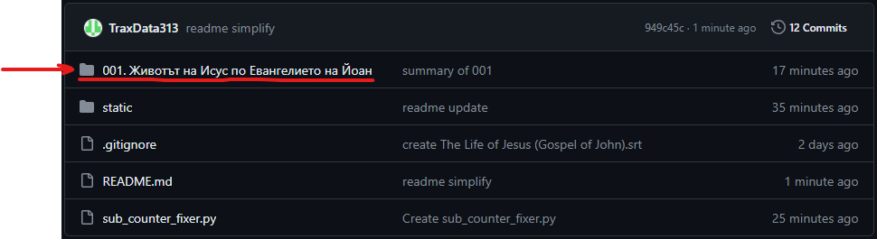
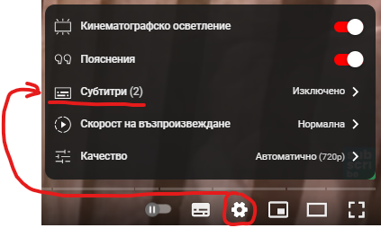
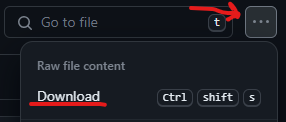

# Български субтитри за Християнстки Youtube видеа
Използвам репото за споделяне на преведени видеа с църква, семейство и приятели, но съм разписал и инструкция, за да може свободно да се споделя и с други хора

## Инструкции:
### Вариант 1:
- Отворете папката на видеото/филма, който искате да гледате

    
- Отворете файла "video_link.txt" и последвайте линка вътре

    
- Вижте дали субтитрите на български са качени от автора и ако да, може да гледате видеото от там, ако не - използвайте Вариант 2 за да свалите видеото и субтитрите локално

    

### Вариант 2:
- Отворете папката на видеото/филма, който искате да гледате
- Отворете файла "video_link.txt" и копирайте линка вътре

    
- Свалете видеото с [ssyoutube](https://ssyoutube.com/en157rN/youtube-video-downloader) или [друг онлайн инструмент](https://www.google.bg/search?q=download+long+youtube+video+free+online&sca_esv=593588080&sxsrf=AM9HkKnnUsgKI12RhkICKNfJ3okcnMvK_w%3A1703512801819&source=hp&ei=4YqJZf35Lu3ixc8Pioi8qAc&iflsig=AO6bgOgAAAAAZYmY8eL7NQwo-GYqyCowxsapx5ETElIE&ved=0ahUKEwi97q3b36qDAxVtcfEDHQoED3UQ4dUDCAo&uact=5&oq=download+long+youtube+video+free+online&gs_lp=Egdnd3Mtd2l6Iidkb3dubG9hZCBsb25nIHlvdXR1YmUgdmlkZW8gZnJlZSBvbmxpbmUyBhAAGBYYHjIGEAAYFhgeSL6RAVAAWPCEAXAAeACQAQCYAYoBoAH6IaoBBTM3LjExuAEDyAEA-AEBwgILEC4YgAQYxwEY0QPCAgUQABiABMICBRAuGIAEwgIIEC4YgAQY1ALCAgsQABiABBiKBRiGA8ICBhAAGAUYHsICBxAAGIAEGA3CAggQABgIGAcYHsICCBAAGAUYHhgNwgIIEAAYCBgeGA0&sclient=gws-wiz), използвайки копирания линк
- Свалете файловете със субтитрите

     

- Поставете видеото и субтитрите в една папка и ги стартирайте някой видео player, например безплатният [GOM](https://www.gomlab.com/gomplayer-media-player/)
- Пишете ми на anton.georgiev313@gmail.com, ако имате въпроси

## Лиценз:
Всички файлове са без лиценз и можете да ги модифицирате, използвате и споделяте без нужда от нищо допълнително.